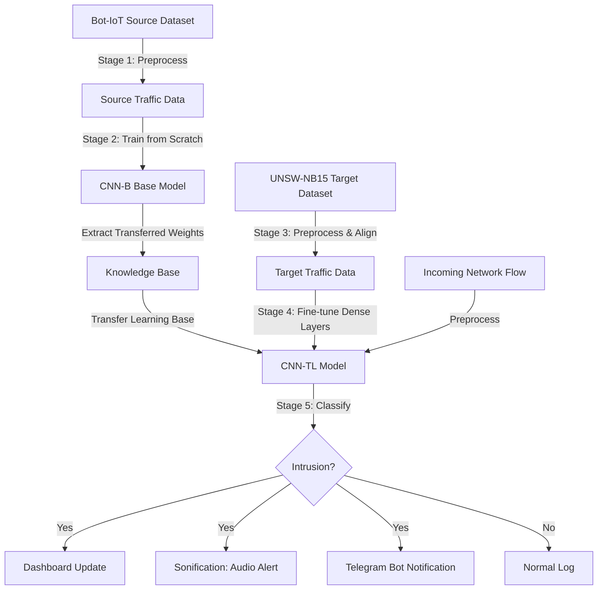

# Transfer Learning Based Network IoT Intrusion Detection Framework with Audio Feedback

An inclusive, high-performance Network Intrusion Detection System (NIDS) designed for Internet of Things (IoT) environments. This framework utilizes **Transfer Learning (TL)** to achieve rapid adaptation to dynamic network traffic with low computational overhead, and integrates **Sonification (Audio Alerts)** and **Telegram Bot notifications** to deliver real-time, multi-modal security feedback.

---

## 📌 Project Overview

Traditional intrusion detection systems (IDS) heavily depend on visual dashboards and textual logs. In fast-paced Security Operation Center (SOC) environments, this can lead to visual fatigue and delayed response times. Moreover, visual-only interfaces present accessibility barriers for visually impaired analysts.

This research addresses these limitations by developing a multi-modal IDS framework:
1. **Detection Core**: A Convolutional Neural Network (CNN) trained using Transfer Learning to bridge the "domain shift" between general network traffic and heterogeneous IoT environments.
2. **Notification Core**: A sonification module that translates threat classification outputs (e.g., attack types, severities) into unique real-time auditory alerts, complemented by Telegram Bot alerts for remote monitoring.

---

## ⚙️ System Architecture

The framework functions across two primary domains—the source domain (**Bot-IoT dataset**) and the target domain (**UNSW-NB15 dataset**):



### Key Stages:
- **Stage 1: Preprocessing Source Data**: Standardizing labels, cleaning null values, encoding protocols, and applying logarithmic transformations to skewed traffic features on the Bot-IoT dataset.
- **Stage 2: Baseline Training (CNN-B)**: Training a baseline CNN on the processed source data (1,000,000 samples) to establish general representation weights.
- **Stage 3: Feature Space Alignment**: Preprocessing the target UNSW-NB15 dataset and inserting auxiliary columns to maintain structural feature compatibility between domains.
- **Stage 4: Fine-Tuning (CNN-TL)**: Adapting pretrained convolutional filters (frozen weights) and training newly initialized dense layers on the target dataset.
- **Stage 5: Alert Integration**: Feeding predictions in real time to the Sonification module (varying pitch, repetition rates, and volume based on threat severity) and triggering a Telegram notification.

---

## 📊 Performance Metrics & Results

The Transfer Learning model (**CNN-TL**) was evaluated on the **UNSW-NB15 dataset** and compared against a Non-Transfer Learning baseline (trained from scratch on the target domain) and the original baseline paper:

### Performance Comparison

| Model | Evaluation Accuracy | Precision | Recall (Detection Rate) | F1-Score |
| :--- | :---: | :---: | :---: | :---: |
| **CNN-B (Base - Bot-IoT)** | **99.98%** | — | — | — |
| **CNN-TL (This Project)** | **99.09%** | **99.86%** | **98.53%** | **99.21%** |
| **Non-TL Baseline** | 98.83% | 98.70% | 98.52% | 98.61% |
| **Original Reference Paper** | 99.04% | 99.06% | 99.04% | 99.05% |

### Per-Class Detection Rates (CNN-TL)
- **Analysis**: 100%
- **Fuzzers**: 99.89%
- **Shellcode**: 99.82%
- **Backdoor**: 99.14%
- **Worms**: 96.88%

*Note: The extremely high precision (99.86%) effectively eliminates false alarms, mitigating "alert fatigue" for SOC analysts.*

---

## 🧠 Model Architecture

### 1. Base Model (CNN-B)
- **Conv2D Layer 1**: 32 filters, $3 \times 3$ kernel, ReLU activation
- **MaxPooling2D 1**: pool size $2 \times 2$
- **Conv2D Layer 2**: 64 filters, $3 \times 3$ kernel, ReLU activation
- **MaxPooling2D 2**: pool size $2 \times 2$
- **Flatten**: Converts features into a 1D vector of size 1,408
- **Dense Layer**: 444 units, ReLU activation
- **Output Layer**: 2 units, Softmax activation (Binary: Normal vs. Attack)

### 2. Transfer Learning Model (CNN-TL)
- **Frozen Convolutional Base**: Sequential layer containing pretrained filters from CNN-B (20,096 frozen parameters).
- **Flatten**: 1D vector of size 1,408.
- **Dense Layer 1**: 448 units, ReLU activation, Dropout (50%)
- **Dense Layer 2**: 224 units, ReLU activation, Dropout (50%)
- **Dense Layer 3**: 112 units, ReLU activation, Dropout (50%)
- **Output Layer**: 2 units, Softmax activation (Fine-tuned binary prediction)

---

## 🔊 Sonification & Alert Parameters

Auditory alerts map detected threat patterns to distinctive sound dimensions:
- **Pitch**: Higher pitch represents critical system attacks (e.g., Backdoors, Shellcode); lower pitch indicates lower-severity anomalies.
- **Rhythm & Repetition**: Fast, pulsing frequencies indicate high-rate traffic flooding (e.g., DoS/DDoS); slower tempos represent isolated intrusion signatures.
- **Volume & Duration**: Adjusted to indicate the persistence of continuous malicious flows.

---

## 💻 Development Environment

- **Language**: Python 3.8
- **Deep Learning Framework**: TensorFlow with Keras API
- **Machine Learning Utilities**: Scikit-Learn
- **Data Manipulation**: Pandas, NumPy
- **Visualizations**: Matplotlib, Seaborn
- **Development Platform**: Jupyter Notebook (Google Colab / Local environment)
- **Hardware Specs**: MacBook Air M1 (8-core CPU, 8-core GPU, 8GB RAM) & UPM INSPEM HPC

---

## 🚀 Execution Guide

1. **Prerequisites**:
   Ensure you have Python installed with the necessary dependencies:
   ```bash
   pip install pandas numpy scikit-learn tensorflow matplotlib seaborn
   ```
2. **Dataset Setup**:
   Download the **Bot-IoT** and **UNSW-NB15** datasets and place them under the `dataset/` directory.
3. **Run the Notebook**:
   Open and execute the Jupyter notebook:
   ```bash
   jupyter notebook fypTL.ipynb
   ```
   Follow the cellular execution blocks:
   - **Mount GDrive**: Connects to the cloud if running on Google Colab.
   - **Load Dataset & Preprocessing**: Cleans variables, encodes features, and aligns datasets.
   - **Model Training**: Runs source training (CNN-B) and saves weights for transfer learning (CNN-TL).
   - **Model Evaluation**: Generates accuracy, loss curves, confusion matrices, and prints performance summaries.

---

## 👥 Authors & Supervision
- **Author**: Nurul Farizatul Aina Binti Mohammad Farizal (Matric No: 216638)
- **Supervisor**: Madam Y.M. Raja Azlina Binti Raja Mahmood
- **Institution**: Universiti Putra Malaysia (UPM), Faculty of Computer Science and Information Technology
- **Degree**: Bachelor of Computer Science (Computer Network)
